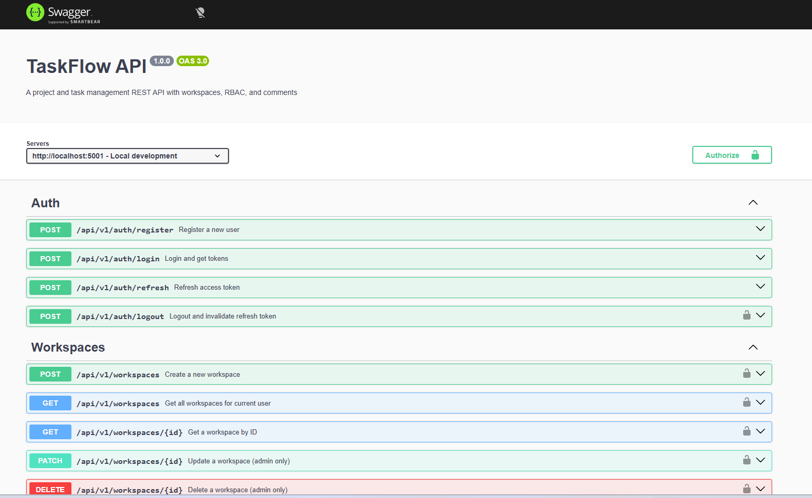
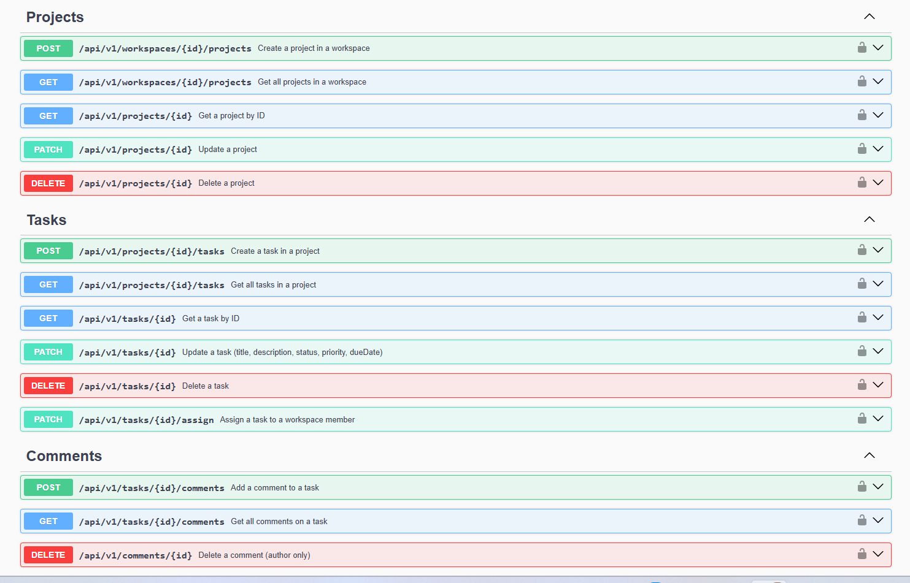

# TaskFlow API

A multi-tenant task management REST API written in TypeScript on top of Express, PostgreSQL and Prisma. It is the kind of backend I reach for when a team needs more than a side-project: typed end to end, validated at the edge, isolated per tenant, and packaged so a new contributor can be running it locally in under a minute.

**Live API:** _to be added once deployed_
**API documentation:** served at `/api/docs` when the server is running (Swagger UI)



---

## What it does

TaskFlow models the day-to-day shape of a small product team. Users sign up, create a workspace, invite teammates with a role, group their work into projects, and track individual tasks through a lifecycle. Comments hang off tasks. Everything is scoped to a workspace, and every endpoint that touches workspace data goes through a membership check before any query runs.

The data model:

- **User** — credentials, refresh tokens, the things they have created
- **Workspace** — the tenant boundary; owned by a user, joined through `WorkspaceMember`
- **WorkspaceMember** — the join row that carries the role (`OWNER`, `ADMIN`, `MEMBER`)
- **Project** — lives inside a workspace, groups related tasks
- **Task** — title, description, status, priority, assignee, due date, creator
- **Comment** — text on a task, owned by the author

---

## Why I built it this way

A few decisions worth calling out, because they are the parts that separate a tutorial project from something you would actually deploy:

**Refresh-token rotation.** Access tokens are short-lived (15 minutes by default). On `/auth/refresh`, the presented refresh token is revoked and a new one issued in the same transaction. Refresh tokens are stored hashed, expirable and revocable, so logout actually means logout.

**Authorization at the boundary, not sprinkled in services.** Workspace, project and task access checks live in dedicated middleware (`workspace.middleware.ts`, `project.middleware.ts`, `task.middleware.ts`). Each one resolves the resource, confirms the requesting user is a member, and attaches their role to the request. Controllers and services can then trust the caller without re-querying.

**Validation as a contract.** Every request body, query string and route param is parsed through a Zod schema before it reaches the controller. If a field is missing or the wrong shape, the request never touches the database — it returns a structured 400 from a single error middleware.

**A consistent response envelope.** All success and error responses use the same shape, produced from helpers in `utils/ApiResponse.ts`. Clients never have to special-case "did this endpoint return `data` or `result`?".

**Modular folder layout.** Each domain (`auth`, `workspace`, `project`, `task`, `comment`) owns its routes, controller, service, schemas and middleware. There is no `controllers/` mega-folder. Adding a new feature is a matter of dropping in a new folder, not threading code through five layers.

---

## Tech stack

| Layer        | Choice                          |
| ------------ | ------------------------------- |
| Runtime      | Node.js 24                      |
| Language     | TypeScript                      |
| Framework    | Express 5                       |
| Database     | PostgreSQL                      |
| ORM          | Prisma                          |
| Auth         | JSON Web Tokens, bcrypt hashing |
| Validation   | Zod                             |
| Logging      | Pino with request correlation   |
| Security     | Helmet, CORS, rate limiting     |
| Docs         | Swagger UI (OpenAPI 3)          |
| Tests        | Vitest, Supertest               |
| Tooling      | pnpm, Docker Compose, tsx       |

---

## API surface

All routes are versioned under `/api/v1`.

| Area       | Routes                                                                            |
| ---------- | --------------------------------------------------------------------------------- |
| Auth       | `POST /auth/register`, `POST /auth/login`, `POST /auth/refresh`, `POST /auth/logout`, `GET /auth/me` |
| Workspaces | `GET/POST /workspaces`, `GET/PATCH/DELETE /workspaces/:id`, member management endpoints |
| Projects   | `GET/POST /workspaces/:id/projects`, `GET/PATCH/DELETE /projects/:id`             |
| Tasks      | `GET/POST /projects/:id/tasks`, `GET/PATCH/DELETE /tasks/:id`, `PATCH /tasks/:id/assign` |
| Comments   | `GET/POST /tasks/:id/comments`, `PATCH/DELETE /comments/:id`                       |

List endpoints accept `page`, `limit`, `sortBy`, `order` and the filters that make sense for that resource (for example, status and priority on tasks). The full request and response schemas are in the Swagger UI.

---

## Running it locally

You need Docker and pnpm.

```bash
git clone https://github.com/MunawarJamil/taskflow-api
cd taskflow-api
cp .env.example .env
docker-compose up -d
pnpm install
pnpm exec prisma migrate dev
pnpm dev
```

The API will be on `http://localhost:5001`. Swagger UI is at `http://localhost:5001/api/docs`.

Seed a handful of users, a workspace and some tasks to play with:

```bash
pnpm seed
```

A Postman collection is checked in at `postman_collection.json` if you would rather click than curl.

---

## Tests

Integration tests run against a real Postgres instance using a separate `.env.test`. They cover the parts of the system most likely to break in subtle ways: registration, login, refresh-token rotation, workspace membership enforcement, and the full task lifecycle including the assignment role check.

```bash
pnpm test
```

---

## Project layout

```
src/
  app.ts                  Express app composition
  server.ts               Process entry, graceful shutdown
  config/                 env parsing, logger, Prisma client
  middleware/             auth, validation, rate limiting, error handling
  modules/
    auth/                 register, login, refresh, logout, me
    workspace/            workspaces and membership
    project/              projects within a workspace
    task/                 tasks with status, priority, assignment
    comment/              comments on tasks
  docs/                   Swagger spec
  utils/                  response helpers, error classes
prisma/                   schema, migrations, seed
tests/                    Vitest + Supertest integration tests
```

---

## What I would add next

- Deploy the API behind a managed Postgres instance and publish the live URL
- WebSocket channel for real-time task updates inside a workspace
- Background worker (BullMQ) for email notifications on assignment and due dates
- Audit log on sensitive actions (role changes, deletions)
- Service-to-service API keys for integrations that should not use a user account

---
